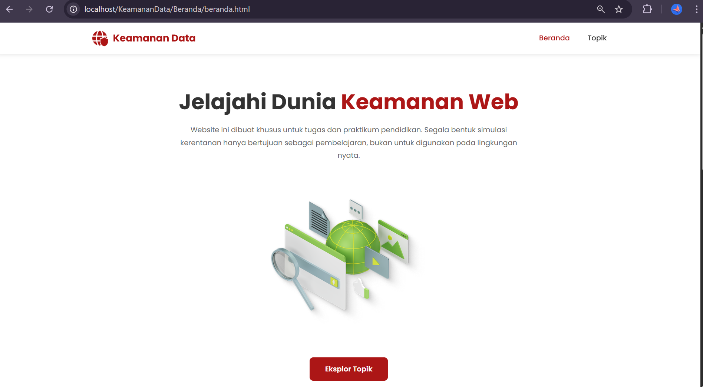
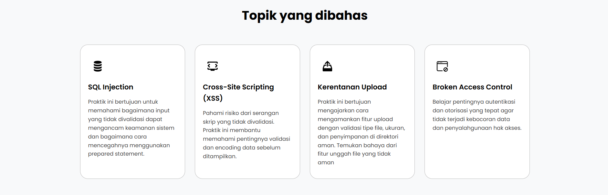

# Analisis Kerentanan Aplikasi Web
Repositori ini berisi kode dan dokumentasi hasil praktikum yang berfokus pada analisis mendalam mengenai kerentanan keamanan aplikasi web modern. Proyek ini bertujuan untuk mendemonstrasikan perbedaan kritis antara implementasi kode yang rentan (Vulnerable) dan implementasi yang aman (Safe).
# 🛡️ Web Security Lab: Analisis Kerentanan Aplikasi Web

 

# Topik Utama yang Dianalisis 🚀 
Praktikum ini mencakup empat materi :
1. SQL Injection (SQLi)
Fokus: Eksploitasi melalui string concatenation dan mitigasi menggunakan Prepared Statements.
2. Cross-Site Scripting (XSS)
Fokus: Demonstrasi Stored XSS dan pencegahan melalui teknik Output Encoding.
3. Kerentanan File Upload
Fokus: Eksploitasi Remote Code Execution (RCE) melalui upload berkas berbahaya dan mitigasi melalui White-listing dan validasi MIME Type.
4. Broken Access Control (BAC) / Insecure Direct Object Reference (IDOR)
Fokus: Eksploitasi akses data pengguna lain dengan manipulasi ID objek, dan pencegahan melalui Ownership Check di setiap permintaan.

🛑 PERINGATAN PENTING (DISCLAIMER)
Repositori ini dibuat sepenuhnya untuk tujuan pembelajaran, penelitian akademis, dan edukasi di lingkungan terkontrol (praktikum).
